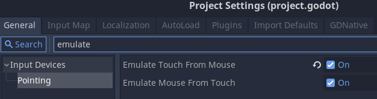

# Godot 3D camera touch control (Godot 3.x)

This asset provides a 3d camera that can me controlled from a touch screen interface.
If you a searching for a very sophisticated touch gesture solution instead, take a look at the awesome [Godot Touch Input Manager](https://github.com/Federico-Ciuffardi/GodotTouchInputManager) asset!
Unfortunately, I experienced some glitches after processing the raw touch events that godot provides, which I also experienced when using this library (in some corner cases, may only be me though).
Because of this, and also to be independent from other assets, I implemented a less sophisticated, simpler, but hopefully a bit more robust touch input manager that serves the purpose of this asset.

## TouchCamera

### How the TouchCamera behaves

The camera is generall a turn-around camera with a `turn_center` position, which is highlighted when the display is touched.
 * The `turn_center` is *always* at the center of the viewport
 * The distance between `turn_center` and camera (`turn_center_distance`) can be adjusted
 * The camera is never rotated/tilted around the view axis, but *pitch* and *yaw* can be changed
 * The `turn_center` position can be moved

The camera has two movement modes: translation and rotation.

| In rotation mode, a single-finger-drag or mouse-drag movement controls the pitch and yaw of the camera | In translation mode, a single-finger-drag or mouse-drag movement controls movement along the ground plane | In both mode 2 finger pinch gestures control the `turn_center_distance` and up/down dragging controls the y-axis movement |
| ---- | ---- | ---- |
|  |  |  |

### How to use

You can take a look at the example project, if you like. But I can summarize it ito the following steps:
 * install and activate plugin (the touch input manager needs to be autoloaded)
 * insert the touch camera scene into your scene (`res://addons/touch_camera/scenes/TouchCamera.tscn`)
 * insert a button (for example this one: `res://addons/touch_camera/scenes/ButtonCamMode.tscn`) into your scene to switch between move/rotate modes
 * reference the button in the camera node (see `button_cam_mode` variable)
 * optionally, enable `editable children` for the TouchCamera scene and move the inner camera along the z-axis (positive direction) to initially set the `turn_center_distance` to a value other than 0.

Please note that I recommend to **activate the 'emulate touch' and 'emulate mouse' event** in the project sesttings, see

## TouchCamera2D

The TouchCamera2D is an othogonal camera, for which the position and scaling can be controlled. There is no mode switch here, which makes it easy to use

### How to use
 * install and activate plugin (the touch input manager needs to be autoloaded)
 * insert the touch camera 2d scene into your scene (`res://addons/touch_camera/scenes/TouchCamera2D.tscn`)

## ButtonSelectCamera

If you are using multiple cameras and want to give the user a simple way to switch between them manually, you can add the `ButtonSelectCamera.tscn` to your scene and add the button nodepaths in the node properties.